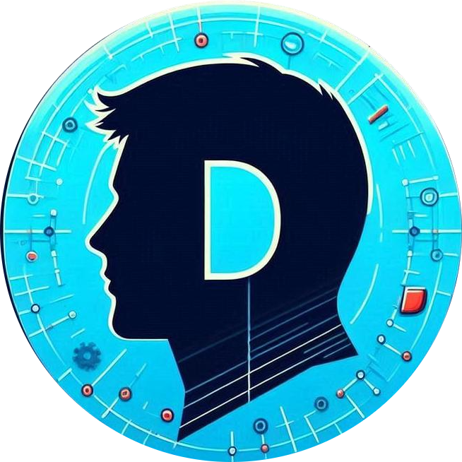

# Devvrat Hans - Interactive Portfolio Terminal

🚀 **A modern, interactive terminal-themed portfolio website showcasing full-stack development skills**



## ✨ Features

- **🎯 Interactive Terminal Interface** - Fully functional command-line experience
- **🎪 Animated ID Card** - Physics-based pendulum animation with realistic effects
- **📱 Responsive Design** - Seamless experience across all devices
- **♿ Accessibility Focused** - Keyboard navigation and screen reader support
- **🎨 Modern Animations** - CSS keyframes with smooth transitions
- **⚡ Performance Optimized** - Vanilla JavaScript, no frameworks needed

## 🛠️ Tech Stack

- **Frontend**: HTML5, CSS3, Vanilla JavaScript
- **Styling**: Custom CSS with CSS Grid, Flexbox, and Animations
- **Typography**: Inter & JetBrains Mono fonts
- **Icons**: Unicode emojis for cross-platform compatibility

## 🎮 Terminal Commands

Try these commands in the interactive terminal:

### Core Information
- `help` - Show all available commands
- `about` - Learn about my background and expertise
- `skills` - View my technical skills and proficiency levels
- `projects` - Browse my featured projects and achievements
- `contact` - Get my contact information and social links

### Professional Details
- `experience` - My professional journey and roles
- `education` - Academic background and certifications
- `resume` - Download my latest resume
- `github` - Quick access to my GitHub profile
- `linkedin` - Quick access to my LinkedIn profile

### System Commands
- `clear` - Clear the terminal (Ctrl+L works too!)
- `ls` - List directory contents
- `tree` - Show directory structure
- `pwd` - Print working directory
- `date` - Show current date and time

## 🚀 Getting Started

1. **Clone the repository**
   ```bash
   git clone https://github.com/devvrat-hans/devvrat.tech.git
   cd devvrat.tech
   ```

2. **Serve the files**
   ```bash
   # Using Python 3
   python -m http.server 8000
   
   # Using Node.js
   npx serve .
   
   # Or any static file server
   ```

3. **Open in browser**
   ```
   http://localhost:8000
   ```

## 📁 Project Structure

```
devvrat.tech/
├── index.html              # Main HTML file
├── assets/
│   ├── css/
│   │   ├── index.css        # Main styles
│   │   ├── terminal.css     # Terminal-specific styles
│   │   └── animations.css   # Animation definitions
│   ├── js/
│   │   ├── index.js         # Main application logic
│   │   └── terminal.js      # Terminal functionality
│   └── images/
│       ├── profile.jpg      # Profile photo
│       └── devvrat.jpeg     # Additional profile image
├── blogs/
│   └── index.json           # Blog posts metadata
├── robots.txt               # SEO robots file
├── sitemap.xml              # SEO sitemap
└── README.md                # This file
```

## 🎨 Key Animations

- **Pendulum ID Card** - Realistic physics simulation
- **Matrix Rain Effect** - Dynamic background elements
- **Typing Animation** - Terminal cursor blinking
- **Hologram Effect** - Futuristic card overlay
- **Floating Elements** - Subtle hover animations

## 🔧 Customization

### Changing Terminal Theme
```javascript
// In the terminal, type:
theme blue    // Available: green, blue, purple, amber
```

### Adding New Commands
```javascript
// In assets/js/terminal.js
this.commands = {
  // Add your custom command here
  mycommand: this.myCustomFunction.bind(this)
};
```

## 📱 Browser Support

- ✅ Chrome (recommended)
- ✅ Firefox
- ✅ Safari
- ✅ Edge
- ⚠️ IE11+ (limited animation support)

## 🌟 Performance

- **First Contentful Paint**: < 1.5s
- **Lighthouse Score**: 95+
- **Bundle Size**: < 100KB total
- **No external dependencies**

## 🤝 Contributing

Feel free to fork this project and make it your own! If you create something cool based on this design, I'd love to see it.

## 📄 License

This project is open source and available under the [MIT License](LICENSE).

## 📞 Contact

**Devvrat Hans**
- 🌐 Website: [devvrat.tech](https://devvrat.tech)
- 💼 LinkedIn: [devvrat-hans](https://linkedin.com/in/devvrat-hans)
- 🐙 GitHub: [devvrat-hans](https://github.com/devvrat-hans)
- 📧 Email: devvrat.hans@example.com

---

⭐ **Star this repo if you found it helpful!**

*Built with ❤️ and lots of ☕ by Devvrat Hans*
